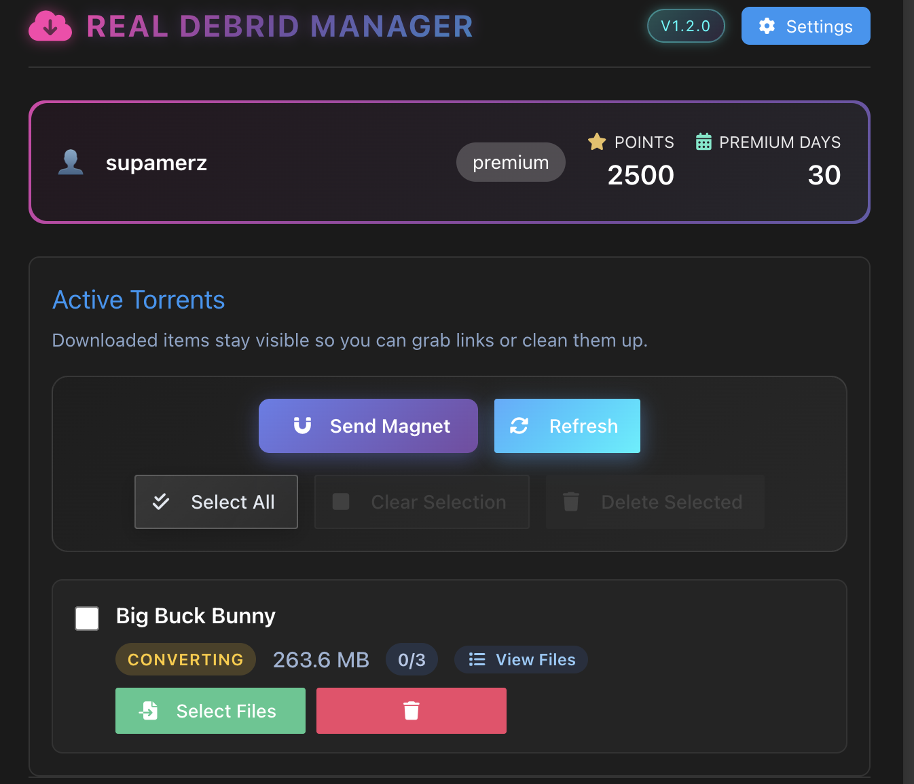

# Real-Debrid Manager

A powerful browser extension for managing your Real-Debrid downloads and torrents. This extension provides a clean, intuitive interface for interacting with the Real-Debrid API, making it easier to manage your downloads and torrents directly from your browser.



## Features

- **User Dashboard**: View your Real-Debrid account information including:
  - Premium status and days remaining
  - Points balance
  - Account type
  
- **Torrent Management**:
  - Add new magnet links
  - View active torrents
  - Select files from torrents for downloading
  - Get unrestricted download links
  - Delete unwanted torrents
  
- **Smart Caching**: Implements efficient caching system for API responses to reduce API calls and improve performance
- **Secure API Key Management**: Safely store and manage your Real-Debrid API key
- **Modern UI**: Clean, responsive interface built with Svelte and Bulma CSS framework

## Technology Stack

- **Frontend Framework**: Svelte
- **Styling**: Bulma CSS & Custom CSS
- **Icons**: Font Awesome
- **Storage**: Chrome Storage API
- **API Integration**: Real-Debrid REST API v1.0

## Getting Started

### Prerequisites

- Node.js (Latest LTS version recommended)
- npm or yarn
- Chrome/Chromium-based browser or Firefox
- Real-Debrid account and API key

### Browser Support

- **Chrome/Chromium**: Version 88 or later
- **Firefox**: Version 89 or later

Note: While the extension works in both Chrome and Firefox, some features might behave slightly differently due to browser-specific APIs.

### Installation

1. Clone the repository:
```bash
git clone https://github.com/staticallydynamic/real-debrid-manager.git
cd real-debrid-manager
```

2. Install dependencies:
```bash
npm install
```

3. Build the extension:
```bash
# Build for both Chrome and Firefox
npm run build:all

# Or build individually
npm run build        # Chrome only
npm run build:firefox  # Firefox only
```

The build process creates browser-specific outputs in the `.output` directory:
- `.output/chrome-mv3/` - Chrome/Chromium build (Manifest V3)
- `.output/firefox-mv2/` - Firefox build (Manifest V2)

Note: The dual build system accounts for the different manifest versions required by each browser:
- Chrome requires Manifest V3
- Firefox currently uses Manifest V2

#### Loading in Chrome/Chromium browsers

1. Open Chrome and navigate to `chrome://extensions/`
2. Enable "Developer mode" in the top right corner
3. Click "Load unpacked" in the top left corner
4. Select the `.output/chrome-mv3` directory from your build

#### Loading in Firefox

1. Open Firefox and navigate to `about:debugging`
2. Click "This Firefox" in the left sidebar
3. Click "Load Temporary Add-on..."
4. Navigate to your project's `.output/firefox-mv2` directory and select the `manifest.json` file

Note: Firefox temporary add-ons will be removed when Firefox is closed. For permanent installation, you'll need to submit the extension to Firefox Add-ons.

### Configuration

1. Get your Real-Debrid API key from [real-debrid.com/apitoken](https://real-debrid.com/apitoken)
2. Click the extension icon in your browser
3. Click the Settings button
4. Enter your API key and save

## Development

To start development server:

```bash
npm run dev
```

### Browser-specific Development Notes

#### Chrome/Chromium
- Changes to the extension require manually clicking the refresh button in `chrome://extensions/`
- Background scripts can be debugged through the extension page in `chrome://extensions/`
- Use Chrome DevTools' "Inspect popup" feature to debug the extension popup

#### Firefox
- Use `about:debugging#/runtime/this-firefox` to debug the extension
- The "Inspect" button lets you debug popup and background scripts
- Use Firefox Browser Toolbox for advanced debugging (Enable in Firefox Developer Tools settings)

### Hot Reload During Development

For convenience during development, you can use extensions that enable hot-reloading:
- Chrome: "Extensions Reloader" or similar
- Firefox: "Extension Auto-Reload" or similar

### Project Structure

The source code is organized as follows:

```
├── src/                      # Source code
│   ├── lib/
│   │   ├── components/      # Svelte components
│   │   │   ├── AddMagnet.svelte
│   │   │   ├── ApiKeyInput.svelte
│   │   │   └── TorrentManager.svelte
│   │   └── shared/         # Shared utilities and types
│   │       ├── CacheManager.ts
│   │       └── types.ts
│   ├── App.svelte          # Main application component
│   ├── app.css            # Global styles
│   ├── index.html         # HTML template
│   └── main.ts           # Application entry point
├── .output/               # Build outputs
│   ├── chrome-mv3/       # Chrome build (Manifest V3)
│   │   ├── manifest.json
│   │   └── ...
│   └── firefox-mv2/      # Firefox build (Manifest V2)
│       ├── manifest.json
│       └── ...
```

## Contributing

We welcome contributions! Here's how you can help:

1. Fork the repository
2. Create a new branch (`git checkout -b feature/amazing-feature`)
3. Make your changes
4. Commit your changes (`git commit -m 'Add some amazing feature'`)
5. Push to the branch (`git push origin feature/amazing-feature`)
6. Open a Pull Request

### Code Style Guidelines

- Use TypeScript for type safety
- Follow Svelte best practices
- Use Bulma classes for layout and basic styling
- Add custom styles within Svelte components using `<style>` tags
- Implement proper error handling and loading states

## API Documentation

This project uses the Real-Debrid API v1.0. Full API documentation can be found in the [official Real-Debrid API documentation](https://api.real-debrid.com/).

## License

This project is licensed under the MIT License - see the [LICENSE](LICENSE) file for details.

## Acknowledgments

- Real-Debrid for providing the API
- Svelte team for the excellent framework
- Bulma team for the CSS framework
- Font Awesome for the icons

## Support

If you encounter any issues or have questions, please:

1. Check the [issues page](https://github.com/staticallydynamic/real-debrid-manager/issues)
2. Open a new issue if your problem hasn't been reported
3. Provide detailed information about your problem including steps to reproduce

---

Made with ❤️ by supamerz